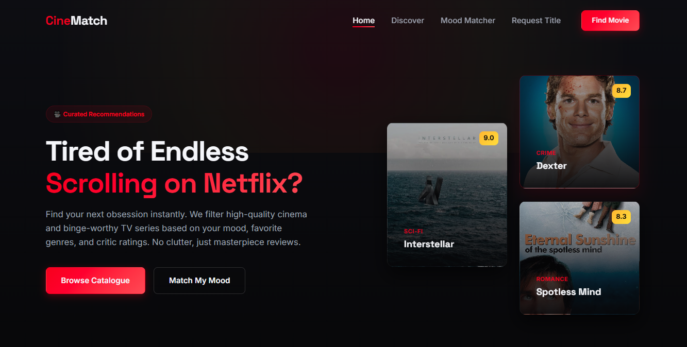
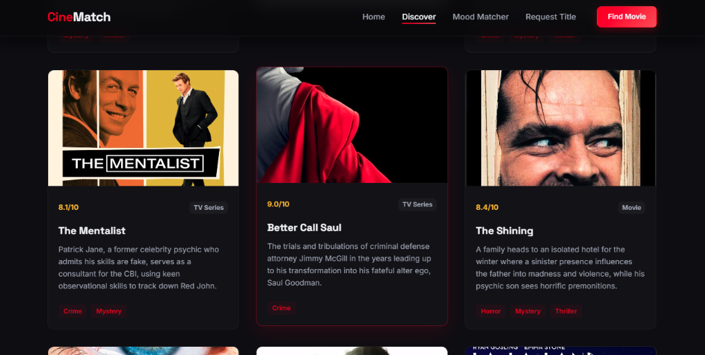

# CineMatch | Find Your Perfect Movie & TV Show

CineMatch is a premium, fully responsive interactive landing page designed to solve "endless scrolling syndrome" on streaming platforms. It serves as a curated catalog and a smart recommendation engine that matches titles to users' mood, format choice, and time availability.

This project was built as **Task 01: Responsive Landing Page** for the web development internship.

---

## 📸 Preview

### Hero & Navigation


### Mood Matcher Recommender


### Interactive Movie Grid


---

## ✨ Features
1. **Interactive Mood Matcher Engine**: A client-side recommendation wizard that filters movies and TV shows instantly based on media type (Movie / TV Series) and mood (Mind-bending, Dark, Romantic, Suspenseful).
2. **Dynamic Multi-Attribute Filtering Grid**: Explore curated films and TV series by content format or specific genres (Mystery, Thriller, Sci-Fi, Romance, Horror, Crime) with zero page reloads.
3. **Glassmorphism & Neon Visual Styling**: Sleek, modern user interface utilizing smooth CSS gradients, glass cards, box-shadow glows, and fluid responsive design principles.
4. **Fluid Micro-Animations**: Features custom slide-ins, scale on hover for film posters, fade-in animations on load, and an interactive hamburger menu.
5. **Interactive Media Lightbox**: Click on any movie card poster to view it in full screen via a responsive modal.
6. **Title Request Form**: Seamless suggestions form with complete HTML5 client-side validations and animated toast feedback for requesting new titles.
7. **Intersection Observer Navigation Tracker**: The navigation header updates automatically to highlight the active section as you scroll down the page.

---

## 🛠️ Built With
- **Frontend Core**: Semantic HTML5, Vanilla CSS3 (Custom Variables, Grid, Flexbox, Animations)
- **Programming Logic**: Vanilla JavaScript (ES6+, Intersection Observer API)
- **Typography & Icons**: Google Fonts (Inter, Space Grotesk)
- **Assets**: Curated custom movie poster graphics inside `images/` directory (with built-in SVG data-URI fallbacks for missing posters).

---

## 📂 Project Structure
```text
├── index.html       # Primary semantic structure, forms, and layout grid
├── style.css        # Core design tokens, layout variables, typography, and responsive media queries
├── script.js        # Navbar scroll hooks, menu drawers, intersection observer, grid filtering, and recommendations
└── images/          # Assets and movie poster graphics
```
